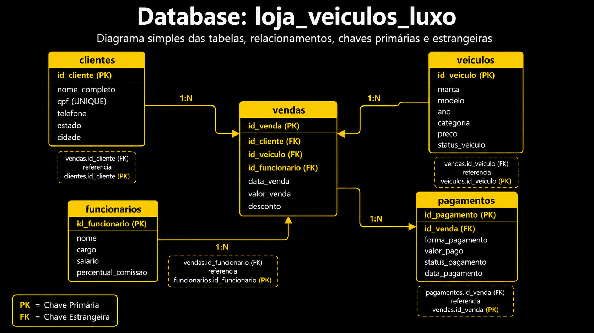

# 🏎️ Banco de Dados Relacional de Loja de Carros de Luxo 

Projeto de banco de dados relacional desenvolvido em **MySQL** para simular a estrutura de uma loja fictícia de carros de luxo.
O objetivo é modelar, criar e consultar uma base de dados organizada, aplicando conceitos fundamentais de banco de dados, como tabelas relacionais, chaves primárias, chaves estrangeiras, integridade referencial e consultas SQL.

## 📊 Sobre o Projeto

Este projeto representa o funcionamento básico de uma loja de veículos de alto padrão, contendo informações sobre clientes, veículos, funcionários, vendas e pagamentos.

A base de dados foi construída com dados fictícios e estruturada para permitir consultas sobre disponibilidade de veículos, vendas realizadas, formas de pagamento, descontos aplicados, comissões de funcionários e relacionamento entre as entidades do negócio.

O projeto passa por etapas importantes da modelagem e manipulação de dados:

* Criação de um banco de dados relacional.
* Modelagem de tabelas com relacionamentos.
* Aplicação de chaves primárias e estrangeiras.
* Inserção de dados fictícios.
* Desenvolvimento de consultas SQL simples e avançadas.
* Uso de JOINs para cruzamento de informações.
* Cálculos de valores finais de venda e comissões.

## 🎯 Objetivos

* Criar uma base de dados relacional para uma loja fictícia de carros de luxo.
* Praticar modelagem de entidades e relacionamentos.
* Aplicar conceitos de integridade referencial com Primary Key e Foreign Key.
* Desenvolver consultas SQL para extração de informações relevantes.
* Analisar vendas, pagamentos, veículos disponíveis e desempenho dos funcionários.
* Documentar a estrutura do banco por meio de um diagrama relacional.

## 🧱 Modelo Relacional

O banco de dados é composto pelas seguintes tabelas:

* **clientes**: armazena informações dos clientes da loja.
* **veiculos**: contém os veículos cadastrados, incluindo marca, modelo, categoria, preço e status.
* **funcionarios**: registra os funcionários responsáveis pelas vendas.
* **vendas**: registra as vendas realizadas, relacionando cliente, veículo e funcionário.
* **pagamentos**: armazena informações sobre forma de pagamento, valor pago e status do pagamento.

## 🔗 Diagrama Relacional

O diagrama abaixo representa a estrutura relacional do banco de dados:



## 🔍 Consultas Desenvolvidas

Foram criadas consultas SQL para responder perguntas como:

* Quais veículos estão disponíveis para venda?
* Quais clientes moram no estado de São Paulo?
* Quais vendas tiveram desconto superior a R$10.000?
* Quais veículos são SUVs com preço acima de R$1.000.000?
* Quais veículos pertencem às marcas BMW ou Porsche?
* Quantos veículos existem cadastrados na loja?
* Qual é o preço médio dos veículos cadastrados?
* Qual cliente comprou determinado veículo?
* Qual funcionário foi responsável por cada venda?
* Qual foi a forma de pagamento utilizada em cada venda?
* Qual o valor final de cada venda após o desconto?
* Qual comissão cada funcionário recebeu por venda?

## 🛠️ Tecnologias Utilizadas

* **MySQL**
* **SQL**
* **Modelagem de Banco de Dados**
* **Diagrama Relacional**

## 📁 Estrutura do Projeto

```bash
📦 Banco-de-Dados-Loja-de-Carros-de-Luxo
┣ 📜 README.md
┣ 📜 LICENSE
┣ 🖼️ diagrama.png
┗ 🗄️ loja_carro_luxo.sql
```
